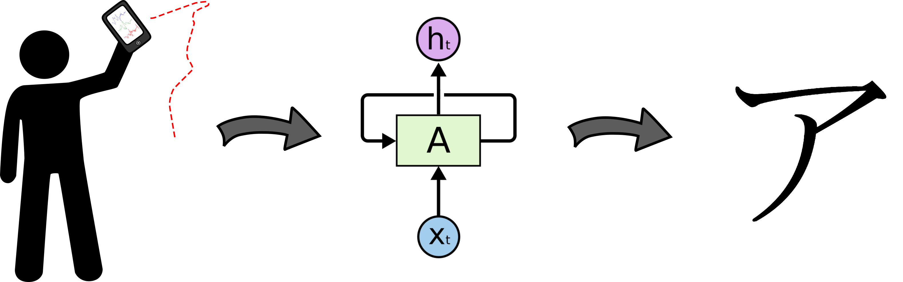

# japanese-character-classification
> japanese character classification based on accelerometer data

    
    
    

Using [LSTM Networks](http://colah.github.io/posts/2015-08-Understanding-LSTMs/) to predict the Japanese characters drawn in the air. 

## How to run the code